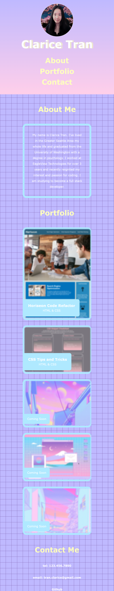

# Clarice Tran's Portfolio

## Description

This is a portfolio website to let users get to know me, see my work, and contact me. In building this portfolio, I was able to learn about wireframing by following a wireframe I had done of my desired site. I also was able to demonstrate my knowledge of applying flex sections in my portfolio and how to build a responsive site when screen sizes change.

## Installation

N/A

## Usage

The portfolio webpage can be found [here](https://claricetran.github.io/clarice-tran-portfolio/).

On hover, links will glow a light green. Clicking on the links in the top navigation will take the user to the related sections.

On a large screen size, the website will look like so:  

On a medium screen size, the website will look like so:  

 
As the page gets smaller in width and reaches 1280px, the sidebar-like section containing the headers will be gone and the headers for the sections will be centered.

On a small screen size, the website will look like so:  
 
As the page gets even smaller in width and reaches 700px, the navigation links in the header and the contact links will align in a column rather than a row.

## Credit

[Placeholder images found here.](https://wallpapercave.com/pastel-vaporwave-wallpapers)
